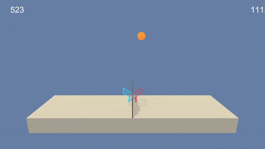
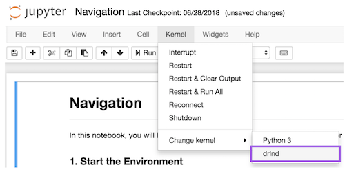

# DRLND-project-3
This repository contains an implementation of project 3 for [Udacity's Deep 
Reinforcement Learning Nanodegree](https://www.udacity.com/course/deep-reinforcement-learning-nanodegree--nd893).

## Project details

This project implements a Multi-Agent Deep Deterministic Policy Gradient (MADDPG) for solving a Unity environment
that plays a mostly cooperative game of tennis in a virtual world.

Recording of final implementation:



In this environment, two agents control rackets to bounce a ball over a net. If an agent hits the ball over the net, 
it receives a reward of +0.1. If an agent lets a ball hit the ground or hits the ball out of bounds, it receives a 
reward of -0.01. Thus, the goal of each agent is to keep the ball in play.

The observation space consists of 8 variables corresponding to the position and velocity of the ball and racket. 
Each agent receives its own, local observation. Two continuous actions are available, corresponding to movement toward 
(or away from) the net, and jumping.

The task is episodic, and in order to solve the environment, your agents must get an average score of +0.5 (over 100 
consecutive episodes, after taking the maximum over both agents). Specifically,

* After each episode, we add up the rewards that each agent received (without discounting), to get a score for each 
agent. This yields 2 (potentially different) scores. We then take the maximum of these 2 scores.
* This yields a single **score** for each episode.

The environment is considered solved, when the average (over 100 episodes) of those **scores** is at least +0.5.

## Getting started

### Dependencies

Dependencies for this project can be setup as per dependencies for the [DRL repository](https://github.com/udacity/deep-reinforcement-learning#dependencies).  The instructions below
walk you through setting up this environment:

1. Create (and activate) a new environment with Python 3.6.
    * Linux or Mac:
    ```
    conda create --name drlnd python=3.6
    source activate drlnd
    ```
    * Windows:
    ```
    conda create --name drlnd python=3.6
    conda activate drlnd
    ```

2. Perform a minimal install of the OpenAI gym, as instructed on [this repository](https://github.com/openai/gym),
or the very helpful instructions at [Open AI Spinning Up](https://spinningup.openai.com/en/latest/user/installation.html).
    * Note that openmpi is not natively supported on Windows 10; I had luck installing instead the [Microsoft MPI](https://docs.microsoft.com/en-us/message-passing-interface/microsoft-mpi).

3. Clone this repository, and install its dependencies:
    ```
    git clone https://github.com/telmo-correa/DRLND-project-3
    cd DRLND-project-3
    pip install -r requirements.txt
    ```
    
    * Note that there seems to be issues installing unityagents on Windows 10 -- conda looks for a required version of
    pytorch that does not seem to be available.  [Commenting out that requirement and installing pytorch separately](https://github.com/udacity/deep-reinforcement-learning/issues/13#issuecomment-475455429)
    worked for me.
 
4. Create an [IPython kernel](http://ipython.readthedocs.io/en/stable/install/kernel_install.html) for the ```drlnd``` environment:
    ```
    python -m ipykernel install --user --name drlnd --display-name "drlnd"
    ```

5. Run the Jupyter notebook using the newly created kernel:



### Downloading the Unity environment

Different versions of the Unity environment are required on different operational systems.

* Linux: [click here](https://s3-us-west-1.amazonaws.com/udacity-drlnd/P3/Tennis/Tennis_Linux.zip)
* Mac OSX: [click here](https://s3-us-west-1.amazonaws.com/udacity-drlnd/P3/Tennis/Tennis.app.zip)
* Windows (32-bit): [click here](https://s3-us-west-1.amazonaws.com/udacity-drlnd/P3/Tennis/Tennis_Windows_x86.zip)
* Windows (64-bit): [click here](https://s3-us-west-1.amazonaws.com/udacity-drlnd/P3/Tennis/Tennis_Windows_x86_64.zip)

Download the corresponding zip file and unpack it.  You will need to point to the location of the file
within the ```Tennis.ipynb``` and ```Report.ipynb``` notebooks in order to run them.

## Instructions

The problem and the environment are available on the ```Tennis.ipynb``` notebook.

The implementation is provided on the ```Report.ipynb```notebook, along with a discussion of its details.
